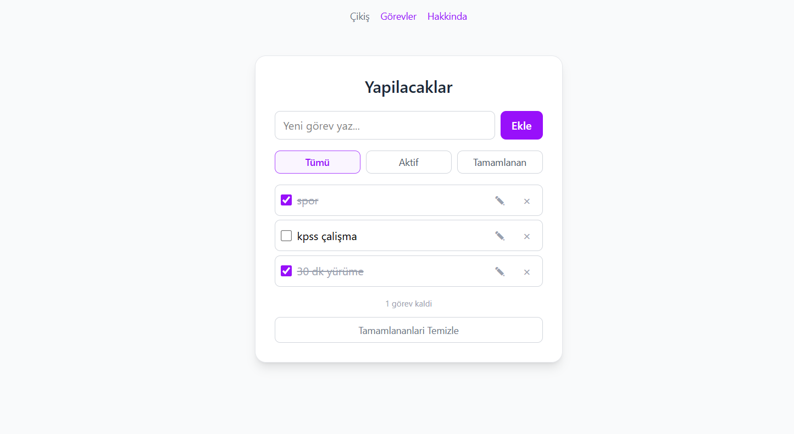
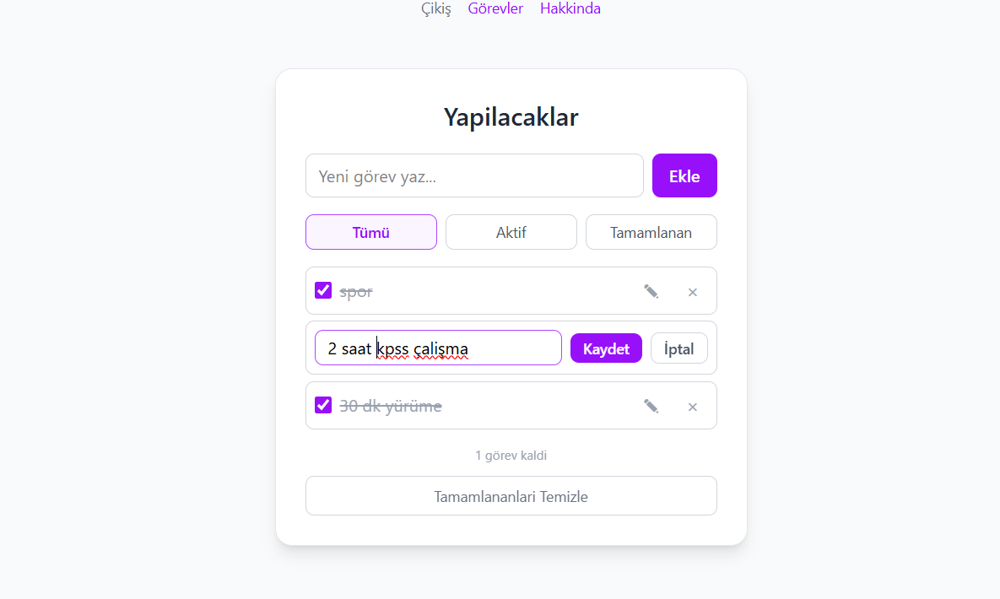
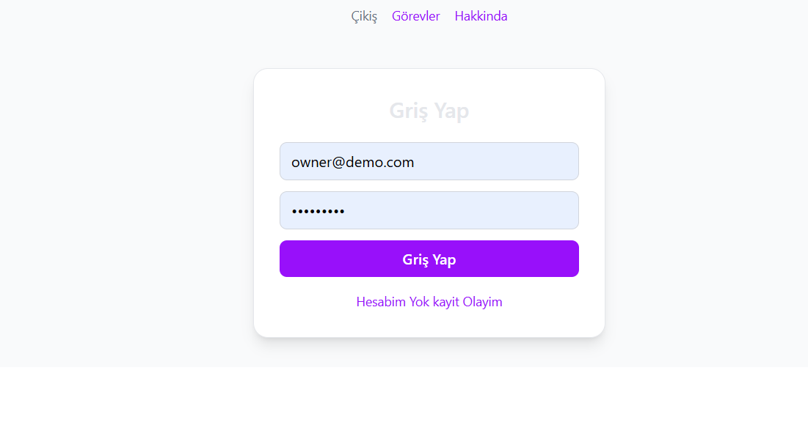
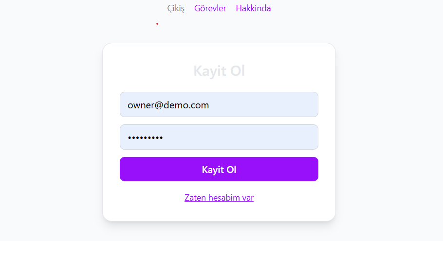

# To-Do App — Frontend

Kullanıcı girişli bir yapılacaklar uygulaması.
React + TypeScript ile yazıldı, Tailwind CSS ile tasarlandı.

**Canlı demo:** https://todo-app-frontend-puce-nine.vercel.app
**Backend repo:** https://github.com/abdussamedcengiz/todo-app-backend

> Not: Backend ücretsiz sunucu planında çalışıyor ve hareketsizken uykuya geçer.
> İlk giriş 30–60 saniye sürebilir.






## Teknolojiler

- React 19 + TypeScript
- Vite
- Tailwind CSS 4
- React Router

## Özellikler

- Kayıt olma ve giriş yapma
- Korumalı rotalar — giriş yapmayan kullanıcı görev sayfasına erişemez
- Görev ekleme, silme, tamamlama
- Satır içi görev düzenleme
- Filtreleme: Tümü / Aktif / Tamamlanan
- Tamamlanan görevleri toplu temizleme
- Kalan görev sayacı
- Yükleniyor ve hata durumları

## Kurulum

```bash
npm install
```

Kök dizinde `.env` dosyası oluştur:

```
VITE_API_URL=http://localhost:5000
```

Geliştirme sunucusunu başlat:

```bash
npm run dev
```

Uygulama `http://localhost:5173` adresinde çalışır.
Backend'in ayrıca çalışıyor olması gerekir — bkz. [backend repo](https://github.com/abdussamedcengiz/todo-app-backend).

## Proje yapısı

```
src/
├── main.tsx          # Giriş noktası, BrowserRouter
├── App.tsx           # Rotalar, navigasyon, korumalı rota
├── TodoPage.tsx      # Görev ekranı
├── LoginPage.tsx     # Giriş / kayıt ekranı
├── About.tsx         # Hakkında sayfası
├── TodoForm.tsx      # Görev ekleme formu
├── TodoItem.tsx      # Tek görev satırı (düzenleme modu dahil)
├── useTodos.ts       # Veri mantığı (custom hook)
├── api.ts            # Backend iletişimi ve token yönetimi
└── types.ts          # Ortak tipler
```

## Mimari notlar

- **Custom hook (`useTodos`)** — tüm veri mantığı bileşenlerden ayrıldı
- **API katmanı (`api.ts`)** — fetch detayları tek yerde, token otomatik eklenir
- **Token yönetimi** — JWT `localStorage`'da saklanır, her istekte `Authorization` başlığıyla gönderilir
- **Korumalı rota** — `RequireAuth` bileşeni, token yoksa `/login`'e yönlendirir

## Komutlar

| Komut             | Açıklama                |
| ----------------- | ----------------------- |
| `npm run dev`     | Geliştirme sunucusu     |
| `npm run build`   | Üretim derlemesi        |
| `npm run preview` | Derlenmiş sürümü önizle |
| `npm run lint`    | ESLint kontrolü         |
