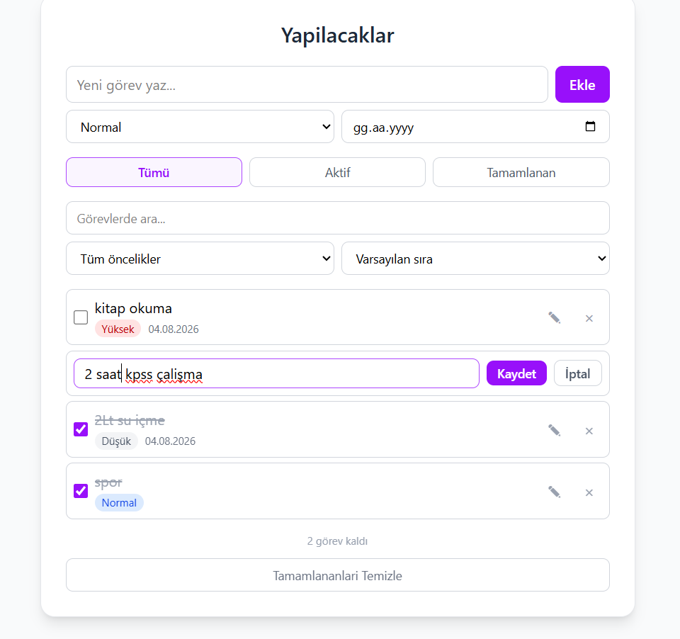
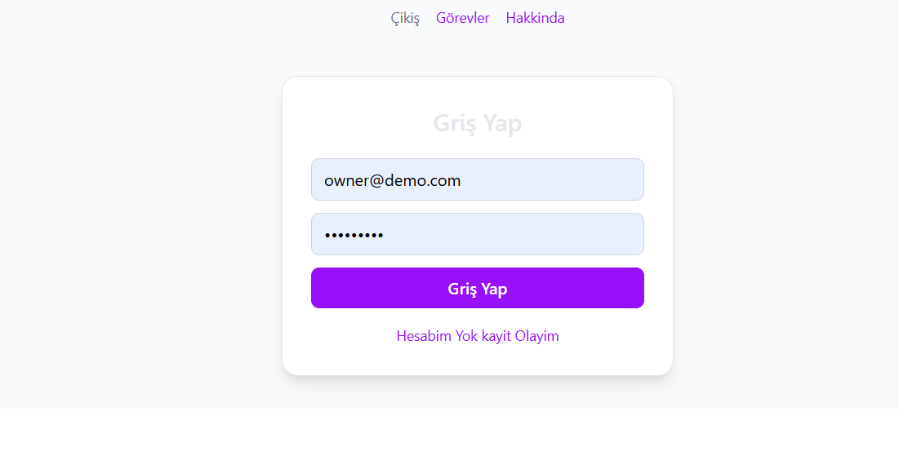
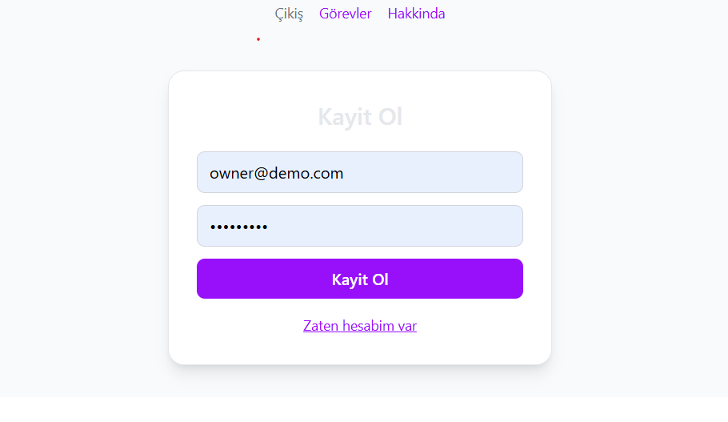

# To-Do App — Frontend

[](https://github.com/abdussamedcengiz/todo-app-frontend/actions/workflows/ci.yml)
[](LICENSE)

Kullanıcı girişli bir yapılacaklar uygulaması.
React + TypeScript ile yazıldı, Tailwind CSS ile tasarlandı.

**Canlı demo:** https://todo-app-frontend-puce-nine.vercel.app
**Backend repo:** https://github.com/abdussamedcengiz/todo-app-backend

> Not: Backend ücretsiz sunucu planında çalışıyor ve hareketsizken uykuya geçer.
> İlk giriş 30–60 saniye sürebilir.





## Teknolojiler

- React 19 + TypeScript
- Vite
- Tailwind CSS 4
- React Router

## Özellikler

- Kayıt olma ve giriş yapma
- Korumalı rotalar — giriş yapmayan kullanıcı görev sayfasına erişemez
- Görev ekleme, silme, tamamlama
- Satır içi görev düzenleme (Enter kaydeder, Esc iptal eder)
- Öncelik (Düşük / Normal / Yüksek) — satır içinde değiştirilebilir
- Son tarih atama
- Filtreleme: Tümü / Aktif / Tamamlanan + önceliğe göre filtre
- Arama (Türkçe karakter duyarlı) ve sıralama
- Tamamlanan görevleri toplu temizleme
- Kalan görev sayacı
- Yükleniyor, hata ve boş durum ekranları
- Oturum süresi dolunca otomatik çıkış
- Erişilebilirlik: form etiketleri, `aria-label`'lar, klavye desteği

## Kurulum

```bash
npm install
```

`.env.example` dosyasını kopyalayıp `.env` yap:

```bash
cp .env.example .env        # Windows: copy .env.example .env
```

| Değişken | Açıklama |
|---|---|
| `VITE_API_URL` | Backend adresi. Varsayılan `http://localhost:5000`. Sonuna eğik çizgi koyma. |

> `VITE_API_URL` **build sırasında** pakete gömülür, çalışma anında okunmaz.
> Değeri değiştirirsen yeniden deploy etmen gerekir.

Geliştirme sunucusunu başlat:

```bash
npm run dev
```

Uygulama `http://localhost:5173` adresinde çalışır.
Backend'in ayrıca çalışıyor olması gerekir — bkz. [backend repo](https://github.com/abdussamedcengiz/todo-app-backend).

## Proje yapısı

```
src/
├── main.tsx              # Giriş noktası, BrowserRouter, AuthProvider
├── App.tsx               # Rotalar, navigasyon, korumalı rota
├── TodoPage.tsx          # Görev ekranı
├── LoginPage.tsx         # Giriş / kayıt ekranı
├── About.tsx             # Hakkında sayfası
├── TodoForm.tsx          # Görev ekleme formu
├── TodoItem.tsx          # Tek görev satırı (düzenleme modu dahil)
├── useTodos.ts           # Görev verisi (custom hook)
├── api.ts                # Backend iletişimi, hata tipi, 401 bildirimi
├── types.ts              # Ortak tipler
├── auth/
│   ├── AuthContext.ts    # Context tanımı
│   ├── AuthProvider.tsx  # Oturum state'i
│   └── useAuth.ts        # Hook
└── lib/
    └── storage.ts        # Güvenli localStorage erişimi
```

`auth/` üç dosyaya bölündü: bir dosya hem bileşen hem bileşen-olmayan
şeyler dışa verirse Vite'in hızlı yenilemesi (fast refresh) o dosyada
çalışmaz ve kod değiştikçe tüm uygulama state'i sıfırlanır.

## Mimari notlar

- **Custom hook (`useTodos`)** — tüm veri mantığı bileşenlerden ayrıldı
- **API katmanı (`api.ts`)** — fetch detayları tek yerde, token otomatik eklenir.
  Her istek `res.ok` kontrolünden geçer ve sunucunun kendi hata mesajını taşıyan
  bir `ApiError` fırlatır; kullanıcı "bir hata oluştu" yerine
  "Şifre en az 8 karakter olmalı" gibi eyleme dönük bir mesaj görür.
- **Oturum state'i (`auth/`)** — token React state'inde tutulur. `localStorage`
  React state değildir: değiştiğinde arayüz kendini yenilemez, bu yüzden
  oturum durumu context üzerinden yayılıyor.
- **Otomatik çıkış** — API katmanı `401` gördüğünde haber verir, `AuthProvider`
  oturumu temizler ve `RequireAuth` kullanıcıyı `/login`'e gönderir. Önceden
  token süresi dolduğunda kullanıcı sebebini göremeden kilitli kalıyordu.
- **Korumalı rota** — `RequireAuth` bileşeni, token yoksa `/login`'e yönlendirir.
  Bu bir **güvenlik önlemi değil**, kullanıcı deneyimi önlemidir; gerçek koruma
  backend'dedir.
- **Güvenli depolama** — `localStorage` gizli sekmede ve site verileri
  engellendiğinde hata fırlatır; sarmalayıcı sayesinde uygulama çalışmaya
  devam eder, sadece oturumu hatırlamaz.

## Komutlar

| Komut             | Açıklama                |
| ----------------- | ----------------------- |
| `npm run dev`     | Geliştirme sunucusu     |
| `npm run build`   | Üretim derlemesi        |
| `npm run preview` | Derlenmiş sürümü önizle |
| `npm run lint`    | ESLint kontrolü         |

## Lisans

MIT — ayrıntılar için [LICENSE](LICENSE) dosyasına bak.
